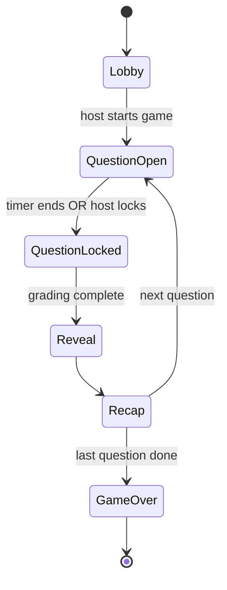
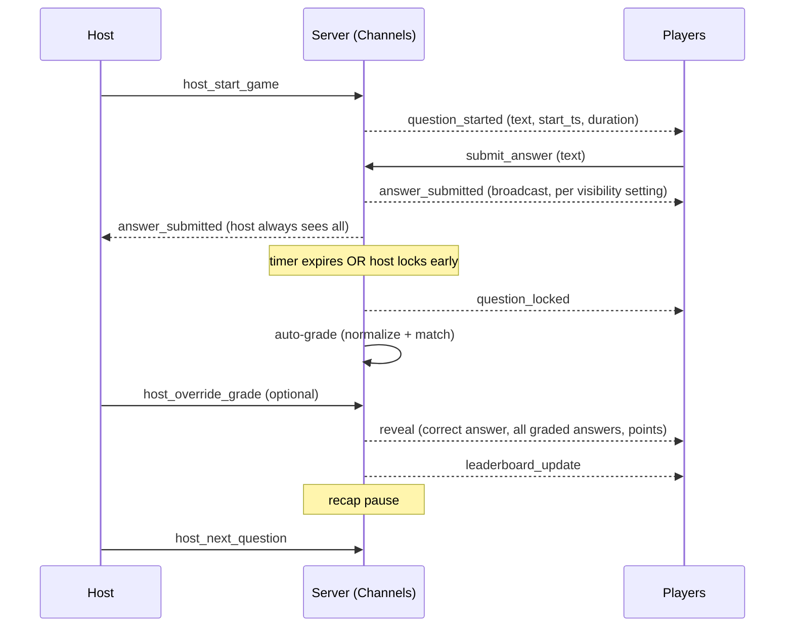

# Zakovat Live — Product & Technical Spec (Draft v0.1)

Working title. A browser-based party quiz: host creates a room, players join
from their own phones/laptops with a code, and — unlike Kahoot — answers are
typed free-text into a shared answer chat — skribbl.io-style — instead of
picked from options, visible to everyone as they come in rather than
staying hidden until reveal. Closer to a live Zakovat / "What? Where?
When?" round crossed with a skribbl.io guess feed than a multiple-choice
quiz show.

---

## 1. Roles

- **Host** — creates the room, sets the rules, controls pacing (start,
  lock, next, override grading). Can also answer as a **Host-Player**, or
  flip to **Host-only / Spectator** and just run the show on a shared screen.
- **Player** — joins with a room code, answers each question from their own
  device.

## 2. Room lifecycle

## 3. Round flow

## 4. Host settings (room config)

| Setting | Description | Suggested default |
|---|---|---|
| `question_count` | Number of questions in the game | 10 |
| `time_per_question` | Seconds to answer, per question | 30s |
| `answers_per_player` | `single` — classic Zakovat, one answer then locked out for the question. `multiple` — skribbl.io-style, keep guessing into the shared chat until you solve it or time runs out | `multiple` |
| `answering_cooldown` | Only applies when `answers_per_player = multiple`. Minimum seconds a player must wait between consecutive submissions, so the chat doesn't get spammed | 5s |
| `recap_duration` | Pause between reveal and the next question opening — a breather to read the leaderboard *(my own suggestion, not something you asked for — easy to cut)* | 8s |
| `answer_visibility` | `as_submitted` (default) — every submission appears in the shared answer chat as it comes in | `as_submitted` |
| `host_participates` | Host also answers as a player | true |
| `max_players` | Room cap | 50 |
| `speed_bonus_enabled` | Extra points for faster correct answers | true |
| `allow_edit_before_lock` | `single` mode only — player can change their one answer until the question locks | true |

## 5. Scoring & grading free-text answers

This is the main design problem free-text introduces (Kahoot sidesteps it
entirely by using multiple choice). Proposed approach:

1. Each question stores one canonical answer plus an optional list of
   accepted alternates/synonyms.
2. Submitted answers are normalized (trim, lowercase, strip punctuation and
   diacritics) before comparison.
3. **Auto-grade** on exact match after normalization, with an optional
   fuzzy/edit-distance threshold for typo tolerance.
4. **Host override** — after auto-grading, the host can flip any individual
   answer correct/incorrect before the reveal is finalized. This matters
   because open-ended trivia answers legitimately vary in phrasing more than
   auto-matching can reliably handle.
5. Points = base point for correct, optionally + speed bonus scaled by time
   remaining at submission.

**In `multiple` mode** (the shared-chat guessing mode), grading happens per
submission rather than once at lock: each new message is auto-graded the
moment it lands in the chat. The first correct submission marks that player
*solved* for the question — later messages from them still post to the
chat (people keep chatting) but stop earning points. Points scale by solve
order and time remaining, skribbl.io-style: first correct answer scores
highest, later correct answers less. One thing worth deciding: whether a
solved player's exact correct text stays visible in the chat, or gets
swapped for a system line ("Alice got it!") so it doesn't spoil the answer
for everyone still guessing — skribbl.io hides it by default.

## 6. Data model

Django apps: `accounts` (host auth), `rooms`, `questions`, `gameplay`.

- **Host** — reuse Django's `User` model, JWT auth (same pattern as
  cookie-boy/ShelfChef).
- **Room** — `code` (short unique join code), `host` (FK), `status`
  (`lobby` / `active` / `ended`), `created_at`.
- **RoomSettings** — one-to-one with `Room`: the fields in §4.
- **Player** — `room` (FK), `nickname`, `session_token` (short-lived guest
  JWT, no account needed), `is_host_player`, `connected`, `joined_at`.
- **Question** — `owner` (FK host, nullable for a shared/public bank),
  `text`, `accepted_answers` (JSON list), `category`, `media_url` (optional).
- **RoomQuestion** — `room` (FK), `question` (FK), `order_index`,
  `started_at`, `locked_at`.
- **Answer** — `room_question` (FK), `player` (FK), `text`, `submitted_at`,
  `is_correct` (nullable until graded), `points_awarded`, `graded_by`
  (`auto` / `host`). One row per submission — in `multiple` mode a player
  can have several rows for the same question.
- **PlayerQuestionState** — `room_question` (FK), `player` (FK), `solved`
  (bool), `solved_at`, `attempts_count`, `last_submitted_at`. Tracks
  cooldown enforcement and solved status per player per question; mainly
  matters in `multiple` mode.

Per-player total score is a sum over `Answer.points_awarded` for the room —
no separate score table needed unless you want a persisted leaderboard
history across games later.

## 7. Real-time layer

REST alone (DRF) can't push room state to players — you need a persistent
connection. Proposed: **Django Channels + Redis** as the channel layer, one
channel *group* per room (group name = room code), served over ASGI
(Daphne or Uvicorn) instead of WSGI/Gunicorn — this replaces, not
supplements, the current Gunicorn setup, since Channels needs the whole
Django process running ASGI. DRF endpoints keep working fine under ASGI.

**WS event catalog**

Client → server: `join_room`, `submit_answer`, `host_start_game`,
`host_lock_question`, `host_override_grade`, `host_next_question`,
`host_end_game`.

Server → clients (broadcast to room group): `player_joined`, `player_left`,
`question_started`, `answer_submitted`, `player_solved`, `question_locked`,
`reveal`, `leaderboard_update`, `game_over`.

Server → sender only (not broadcast): `answer_rejected` — sent back when a
`submit_answer` arrives before that player's `answering_cooldown` has
elapsed, with the remaining seconds so the client can grey out the input.

## 8. REST API surface (DRF)

- `POST /api/rooms/` — create room, returns join code (host JWT required)
- `POST /api/rooms/{code}/join/` — player join, returns guest session token
- `GET /api/rooms/{code}/` — room state snapshot (for reconnect/refresh)
- `CRUD /api/questions/` — host's question bank
- `GET /api/rooms/{code}/results/` — post-game summary

## 9. Frontend (React + Vite)

- Routes: `/` (Create / Join), `/host/:code` (control panel + optional
  player view), `/play/:code` (join + game screen).
- Shared `useRoomSocket()` hook wrapping the WebSocket connection and room
  state.
- Key components: `Lobby`, `QuestionScreen` (+ live `AnswerFeed`),
  `Leaderboard`, `HostPanel` (settings form + start/lock/next/override
  controls).
- State: Zustand or plain Context — no need for Redux at this scale.
- Deploy: Cloudflare Pages, same domain/DNS you're already using there.

## 10. Backend deployment (VPS)

Same box as your other Django projects, plus one new dependency:

- PostgreSQL (existing)
- **Redis** (new — Channels layer)
- Daphne or Uvicorn as the ASGI process, managed via systemd
- Nginx reverse-proxying both normal HTTP and the `/ws/` upgrade path

## 11. Assumptions flagged for confirmation

- Free-text grading needs host override on top of auto-match; pure
  exact-match will misgrade valid answers
- Team mode (multiple players sharing one answer, like the real Zakovat) is
  out of MVP scope, noted below as a natural v2
- `recap_duration` (the pause between reveal and the next question) is my
  own suggestion, not something you asked for — easy to cut if you'd rather
  go straight to the next question
- Whether a solved player's correct text stays visible in the chat or gets
  swapped for a system message is left open — see §5

## 12. Suggested build phases

1. **Core loop** — room create/join, one question round-trip over WS,
   exact-match grading, bare leaderboard.
2. **Live feed** — answer visibility settings, host override grading,
   cooldown/timer polish.
3. **Content & control** — question bank CRUD, host-only/spectator mode,
   speed bonus scoring.
4. **Depth** — team mode, reconnect/resilience, persisted game history,
   sound/motion polish.
